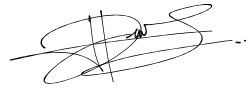

# Deklarasi Penggunaan AI

## Tugas Besar IF2150 - Rekayasa Perangkat Lunak

| Informasi | Keterangan |
|---|---|
| Kelas | *K02* |
| Nomor Kelompok | *G01*  |
| Nama Kelompok | *Swike Karang Anyar*  |
| Nama Perangkat Lunak | *SeaGuard*  |

**Anggota Kelompok:**

| NIM | Nama |
|---|---|
| *13525104* | *Jeremy Gerald Sutanto* |
| *13525116* | *Christian Immanuel* |
| *13525014* | *Denzel Santoso* |
| *13525011* | *Raihan* |
| *13525125* | *Peter Emmanuel Suwardy* |

---

### Daftar Isi
* [Milestone 1](#milestone-1)
* [Milestone 2](#milestone-2)
* [Milestone 3](#milestone-3)

---

### Log Penggunaan AI per Milestone

Silakan catat penggunaan AI yang berdampak signifikan pada pengerjaan tugas (misal: *generate* fungsi algoritma yang kompleks, *generate* draf dokumen SKPL/DPPL, atau *debugging* error utama). 
*Penggunaan sepele seperti memperbaiki *typo* atau auto-complete satu baris kode tidak perlu dicatat.*

### Milestone 1
| Tool AI | Tujuan Penggunaan | Contoh Prompt Utama | Modifikasi & Validasi Manusia |
| :--- | :--- | :--- | :--- |
| *[Nama AI]* | *[Sertakan Tujuan Penggunaan]* | *[Tuliskan Prompt Utama]* | *[Tuliskan Keputusan Hasil Validasi]* |
| *Gemini* | *Mengecek relasi antar class* | *"Apakah relasi antara class User dan Order dalam UML ini seharusnya composition atau aggregation?"* | *AI menyarankan composition, tapi setelah dicek kembali ke requirement, kami menggunakan aggregation karena Order masih bisa eksis di history.* |
| *Gemini* | *Menyusun dan mencari referensi terkait latar belakang pencemaran sampah laut di Indonesia* | *Tolong carikan sumber dan referensi terkait permasalahan pencemaran laut di Indonesia dan hubungannya dengan SDGs 14* | Sumber yang diberikan dicek ulang dan diverifikasi lagi untuk memastikan kebenaran informasi dan data yang diberikan masih relevan dengan kondisi saat ini |

### Milestone 2
| Tool AI | Tujuan Penggunaan | Contoh Prompt Utama | Modifikasi & Validasi Manusia |
| :--- | :--- | :--- | :--- |
| | | | | |
| | | | | |

### Milestone 3
| Tool AI | Tujuan Penggunaan | Contoh Prompt Utama | Modifikasi & Validasi Manusia |
| :--- | :--- | :--- | :--- |
| ChatGPT | *Mengecek penulisan dan kesesuaian use case dengan setiap kebutuhan fungsional* | *Tolong cek penulisan dan cek apakah setiap use case sesuai dengan KFnya* | *Memeriksa kembali hasil yang diberikan dan memperbaiki penulisan sesuai gaya bahasa sendiri* |

---
### Pernyataan Integritas dan Persetujuan

Kami yang bertanda tangan di bawah ini menyatakan bahwa seluruh log penggunaan AI di atas adalah benar. Kami telah memvalidasi seluruh hasil AI dan bertanggung jawab penuh atas orisinalitas, keamanan, dan kebenaran hasil akhir dari tugas ini.

| Tanda Tangan | Nama Anggota |
| :---: | :--- |
|  | **13525104 - Jeremy Gerald Sutanto** |
|  | **13525014 - Denzel Santoso** |
|  | **13525116 - Christian Immanuel** |
|  | **13525011 - Raihan** |
|  | **13525125 - Peter Emmanuel Suwardy** |
