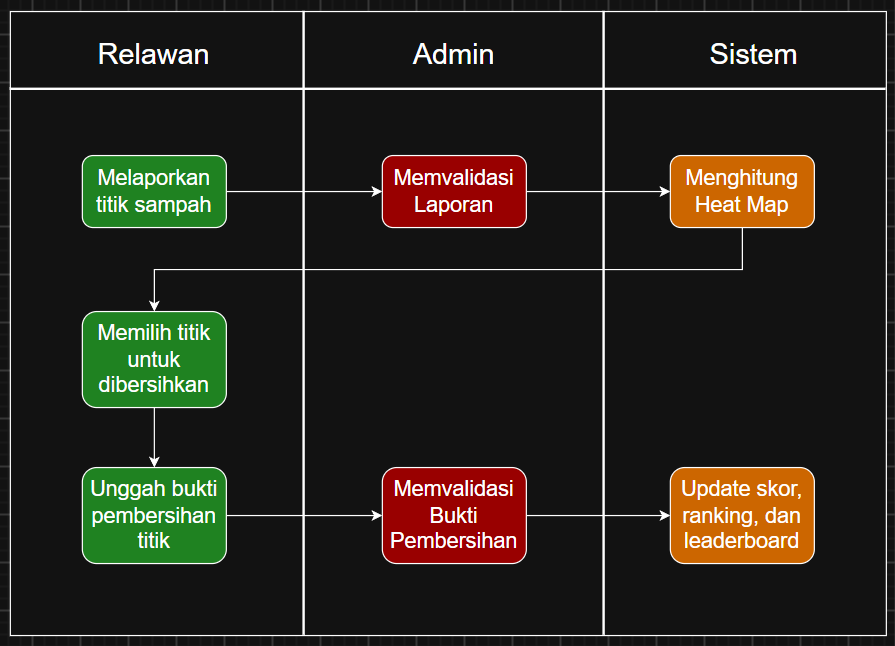

<h1>
IF2150 REKAYASA PERANGKAT LUNAK
 
TUGAS 1
 
TOPIC BRAINSTORMING
</h1>
 

## *Nama Perangkat Lunak*

### Untuk: *Aurelia Jennifer Gunawan*

Dipersiapkan oleh:
| Informasi | Keterangan |
| --- | --- |
| Kelas | *K02* |
| Kelompok | *G01*  |

| NIM | Nama |
|---|---|
| *13525104* | *Jeremy Gerald Sutanto* |
| *13525116* | *Christian Immanuel* |
| *13525014* | *Denzel Santoso* |
| *13525011* | *Raihan* |
| *13525125* | *Peter Emmanuel Suwardy* |
---

 
 

# BAB 1: Analisis Permasalahan

## 1.1 Latar Belakang Masalah
Pencemaran ekosistem laut akibat sampah, khususnya limbah plastik. telah berkembang menjadi salah satu masalah yang besar dan krusial di masa ini. Masalah ini berkaitan erat dengan Tujuan Pembangunan Berkelanjutan (SDGs) 14 yaitu Life Below Water untuk mencegah segala bentuk pencemaran laut, terutama yang bersumber dari aktivitas dari daratan

Berdasarkan publikasi dari World Bank Group (WBG, 2021), Indonesia menghasilkan sebanyak 7,8 juta ton sampah plastik memasukin lautan global setiap tahunnya. Diperkirakan rentang antara 201,1 - 552,3 kilo ton sampah plastik per tahun dibuang ke dalam ekosistem laut yang bersumber dari daratan, di mana 2 per 3 sampah tersebut berasal dari Jawa dan Sumatera. Data Kementerian Lingkungan Hidup dan Kehutanan (KLHK, 2022) juga menunjukkan bahwa tumpukan plastik baik makro ataupun mikroplastik di perairan Indonesia mengancam lebih dari 200 spesies laut, merusak terumbu karang, serta menimbulkan kerugian ekonomi mencapai triliunan rupiah pada sektor perikanan tangkap dan pariwisata bahari.

Urgensi penanganan masalah ini sangat tinggi karena limbah plastik tersebut terombang-ambing di laut sehingga bisa terpecah menjadi mikroplastik yang dapat membahayakan maritim laut dan manusia. Metode pemantauan tradisional secara manual terbukti tidak bisa menyelesaikan masalah sampah laut yang terus terombang-ambing ini. Oleh karena itu, diperlukan penanganan melalui software berbentuk gamifikasi untuk menarik perhatian masyarakat dari berbagai daerah di Indonesia untuk ikut berkontribusi dalam membersihkan sampah laut tersebut.

## 1.2 Analisis Kondisi Saat Ini
Pada kondisi saat ini, upaya atau solusi yang diterapkan untuk mengatasi pencemaran perairan karena sampah masih kurang dan minim dilakukan. Hanya sebagian dikit dari masyarakat yang peduli dan berupaya untuk membersihkan sampah dari perairaan, dan hal ini terjadi secara fragmentasi atayu terpisah. Umumnya, kegiatan pembersihan sampah dari ekosistem perairan hanya dilakukan sesekali bila ada suatu kegiatan organisasi seperti pembersihan pantai dan hal serupa lainnya, atau bila ada yang ingin meneliti terkait hal ini. 

Solusi yang bersifat sementara tersebut tidak terlalu berpengaruh pada hasil akhir jangka panjang dalam membersihkan sampah dari perairan. Hal ini dapat disebabkan dari beberapa hal atau aspek, yaitu kurangnya inisiatif atau motivasi dari masyarakat dan relawan dalam membersihkan sampah. Tidak adanya informasi mengenai lokasi pencemaran serta ketiadaan suatu pusat yang dapat memandu proses pembersihan ini dapat membuat upaya yang dilakukan juga kurang efektif. Selain itu, pemerintah juga kurang memberikan dukungan dalam membantu serta memberikan motivasi pada masyarakat dengan menyediakan suatu aksi yang lebih interaktif hingga memicu rasa peduli lingkungan. 

Selain permasalahan di lapangan secara langsung, terdapat juga kekurangan pada bidang software yang dapat mendukung tindakan atau aksi ini. Salah satu situs web yang berfokus dalam pembersihan ekosistem laut adalah The Oceam Cleanup. Situs ini melakukan pembersihan dengan skala industri, namun masih kurang dalam kerjasama dengan masyarakat lokal dalam pembersihannya. Selain itu, masyarakat hanya dapat kontribusi dengan memberikan sumbangan, namun tidak ada bukti verifikasi hasil pembersihan dan juga mekanisme gamifikasi yang dapat membuat masyarakat lebih aktif dan tertarik dalam okut membersihkan ekosistem laut.

---

# BAB 2: Analisis Solusi

## 2.1 Deskripsi Perangkat Lunak
Untuk mengatasi masalah itu, kelompok kami mengusulkan SeaGuard, sebuah platform yang memungkinkan masyarakat melaporkan dan memantau kondisi pencemaran sampah di wilayah perairan Indonesia.

Secara umum, sistem ini bekerja dengan mengumpulkan laporan dari masyarakat atau relawan mengenai titik titik sampah yang mereka temukan, lengkap dengan foto dan lokasi. Laporan tersebut kemudian diolah menjadi dua bentuk keluaran. Pertama, data statistik mengenai kondisi pencemaran di suatu wilayah, seperti perkiraan volume sampah dan tingkat keparahannya. Kedua, visualisasi berupa heatmap yang menunjukkan sebaran titik pencemaran, sehingga pengguna dapat melihat wilayah mana yang paling membutuhkan penanganan.

Selain fungsi pelaporan dan pemantauan, SeaGuard juga menyediakan mekanisme untuk mencatat kontribusi relawan yang telah membersihkan suatu titik sampah. Setelah tim relawan mengunggah bukti sebelum dan sesudah pembersihan, dan bukti tersebut diverifikasi oleh admin, kontribusi tersebut akan tercatat dalam sistem penilaian dan ditampilkan pada papan peringkat. Mekanisme ini dimaksudkan untuk memberikan bentuk pengakuan atas kontribusi yang dilakukan, sekaligus mendorong partisipasi yang lebih berkelanjutan dibandingkan kegiatan bersih bersih yang biasanya bersifat sesekali.

SeaGuard dikembangkan dalam bentuk aplikasi web agar dapat diakses tanpa proses instalasi, serta memungkinkan data dan visualisasi diperbarui secara langsung begitu ada laporan baru masuk ke dalam sistem.

Dengan demikian, peran SeaGuard terbatas pada pengumpulan, pengolahan, dan penyajian data pencemaran, sementara pelaksanaan pembersihan di lapangan tetap dilakukan oleh masyarakat dan relawan itu sendiri.

## 2.2 Asumsi dan Batasan
Asumsi :
- Relawan / Masyarakat sekitar yang melaporkan adanya pencemaran lingkungan di wilayah tertentu diasumsikan memiliki perangkat yang dapat melaporkan hal itu dan memiliki akses pada internet.
- Pengguna yang memberikan laporan kondisi pencemaran lingkungan perairan dan bukti sebelum dan setelah pembersihan diasumsikan benar dan sesuai dengan kondisi yang nyata dan tidak dipalsukan
- Data laporan yang dikirimkan sudah lengkap dengan informasi wilayah yang akurat dan data pencemaran yang dikirimkan sudah lengkap dan valid

Batasan :
- SeaGuard tidak melakukan pengukuran tingkat pencemaran air sehingga sangat bergantung pada data yang diberikan oleh masyarakat setempat atau relawan
- Proyek dibatasi oleh ketersediaan sumber daya seperti uang dan waktu sehingga pengembangan difokuskan pada fitur-fitur yang utama
- Hasil akhir projek hanya berupa prototipe software yang tidak sempurna dan belum mencakup seluruh fitur yang dibutuhkan untuk implementasi yang nyata
- Peran SeaGuard hanya terbatas pada peran dalam mengumpulkan informasi, mengolahnya, dan menganalisis data pencemaran wilayah. Pelaksanaan kegiatan pembersihan lingkungan berada di luar batasan SeaGuard
- Pengolahan dan analisis data yang dilakukan hanya terbatas pada wilayah-wilayah tertentu di Indonesia dan tidak mecakup seluruh wilayah perairan Indonesia

---

# BAB 3: Spesifikasi Kebutuhan dan Proses Bisnis

## 3.1 Identifikasi Aktor

| Aktor | Deskripsi |
| :--- | :--- |
| *Relawan* | *Pengguna umum (masyarakat/mahasiswa/komunitas peduli lingkungan) yang melaporkan titik sampah, memantau heatmap, mengklaim titik untuk dibersihkan, dan mengunggah bukti pembersihan. Karakteristiknya mengutamakan kemudahan pelaporan dan motivasi berupa skor/kompetisi.* |
| *Verifikator/Admin* | *Pengelola sistem (bisa dari pihak Dinas Lingkungan Hidup, koordinator komunitas, atau tim internal) yang bertugas memvalidasi kebenaran laporan sampah dan bukti pembersihan sebelum skor diberikan. Karakteristiknya mengutamakan akurasi data agar sistem tidak disalahgunakan (laporan palsu/klaim curang).* |

## 3.2 Kebutuhan Pengguna Awal

| ID | Aktor | Kebutuhan / Aktivitas | Tujuan / Nilai |
| :--- | :--- | :--- | :--- |
| US-01 | *Relawan* | *Melaporkan titik sampah dengan foto dan lokasi GPS* | *Data sebaran sampah tercatat akurat dan real-time* |
| US-02 | *Relawan* | *Melihat peta heatmap sebaran sampah* | *Bisa memilih lokasi yang paling butuh dibersihkan* |
| US-03 | *Relawan* | *Mengklaim titik sampah untuk dibersihkan* | *Menghindari duplikasi usaha dengan relawan lain* |
| US-04 | *Relawan* | *Mengunggah bukti before/after pembersihan* | *Mendapatkan pengakuan dan skor atas kontribusinya* |
| US-05 | *Relawan* | *Melihat papan peringkat (leaderboard)* | *Termotivasi berkompetisi secara sehat dengan relawan lain* |
| US-06 | *Verifikator/Admin* | *Memeriksa validitas laporan titik sampah* | *Mencegah data palsu/spam mengotori heatmap* |
| US-07 | *Verifikator/Admin* | *Memvalidasi bukti pembersihan yang diunggah* | *Memastikan skor hanya diberikan untuk pembersihan nyata* |
| US-08 | *Verifikator/Admin* | *Mengelola data pengguna dan komunitas* | *Menjaga kualitas dan keamanan platform* |

## 3.3 Deskripsi Aktivitas
| ID | Aktivitas | Penjelasan | ID User Story |
| :--- | :--- | :--- | :--- |
| A01 | *Melaporkan Titik Sampah* | *Relawan mengunggah foto dan lokasi titik sampah ke sistem* | *US-01* |
| A02 | *Menghitung Skor Kepanasan* | *Sistem menghitung tingkat urgensi tiap titik berdasarkan jumlah laporan dan lama belum ditangani, lalu memperbarui heatmap* | *US-02* |
| A03 | *Memeriksa Validitas Laporan* | *Verifikator meninjau laporan masuk untuk memastikan bukan spam/data palsu* | *US-06* |
| A04 | *Mengklaim Titik untuk Dibersihkan* | *Relawan memilih dan mengunci satu titik di peta sebagai target pembersihannya* | *US-03* |
| A05 | *Mengunggah Bukti Pembersihan* | *Relawan mengunggah foto sebelum dan sesudah sebagai bukti aksi bersih-bersih* | *US-04* |
| A06 | *Memvalidasi Bukti Pembersihan* | *Verifikator memeriksa kesesuaian bukti dengan titik yang diklaim* | *US-07* |
| A07 | *Memberi Skor & Update Leaderboard* | *Sistem memberikan skor sesuai tingkat kepanasan titik yang berhasil dibersihkan, lalu memperbarui papan peringkat* | *US-04, US-05* |
| A08 | *Mengelola Data Pengguna/Komunitas* | *Admin mengatur akun, hak akses, dan data komunitas dalam sistem* | *US-08* |

## 3.4 Model Proses Bisnis
Buatlah *Activity Diagram* atau *Swimlane Diagram* yang menunjukkan alur kerja proses bisnis dari sistem solusi. Diagram ini harus memvisualisasikan bagaimana alur operasional di dunia nyata berjalan lebih efisien dengan adanya interaksi antara aktor (yang didefinisikan pada poin 3.1) dan sistem perangkat lunak. Perhatikan notasi yang digunakan dalam pembuatannya.
 

<i>Gambar 1. Activity Diagram</i>

 

# Referensi
- Diagram URL: https://drive.google.com/file/d/1Gw0aQZLnf4XcgjcNiH7Y9AsN8YVfYWpX/view?usp=sharing
