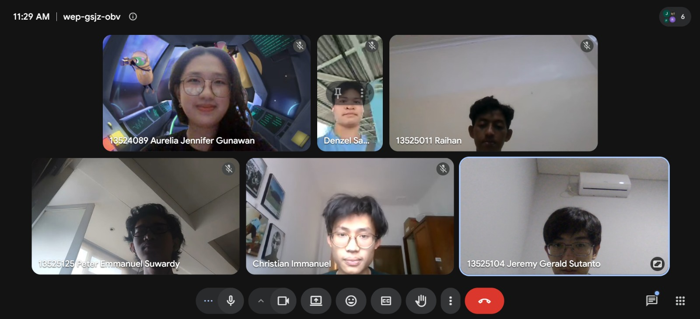

# Form Asistensi

## Tugas Besar IF2150 - Rekayasa Perangkat Lunak

| Informasi | Keterangan |
| --- | --- |
| **Hari** | *Rabu* |
| **Tanggal** | *02/09/2026* |
| **Kelas** | *K02* |
| **Nomor Kelompok** | *G01*  |
| **Nama Kelompok** | *Swike Karang Anyar*  |
| **Nama Perangkat Lunak** | *SeaGuard*  |
| **Dokumen** | *K02_G01_Template1_TB.md*  |

### Anggota Kelompok

| NIM | Nama |
| --- | --- |
| *13525104* | *Jeremy Gerald Sutanto* |
| *13525116* | *Christian Immanuel* |
| *13525014* | *Denzel Santoso* |
| *13525011* | *Raihan* |
| *13525125* | *Peter Emmanuel Suwardy* |

### Catatan

| Catatan |
| --- |
| 1. 1.1: benarkan penulisan. |
| 2. 1.2: kurang research similar software yang ada di internet. |
| 3. 2.1: bikin lebih umum |
| 4. 2.2: asumsi tambahin user punya internet untuk akses app/web nya, tambahin periode pengerjaan berapa lama, tambahin more lah basically |
| 5. 3.1: sistem di hapus dari aktor |
| 6. 3.4: diagramnya: bikin 3 kolom: relawan, admin, dan sistem (tapi sistem bukan aktor) -> bagian sistem gausah terlalu spesifik. bikin yang rapi, jangan kebanyakan garis yang bersilang. nanti kasi link workspace diagramnya others: masukin sumber data yang dipake ke referensi |

## Dokumentasi

<!--  -->

  

  <i>Gambar 1. Dokumentasi kegiatan asistensi.</i>

