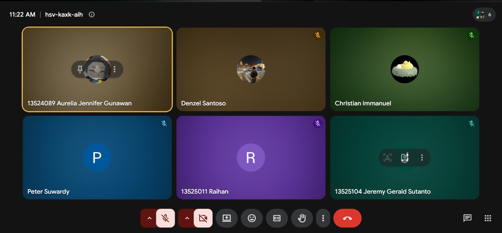

# Form Asistensi

## Tugas Besar IF2150 - Rekayasa Perangkat Lunak

| Informasi | Keterangan |
| --- | --- |
| **Hari** | *Rabu* |
| **Tanggal** | *09/09/2026* |
| **Kelas** | *K02* |
| **Nomor Kelompok** | *G01*  |
| **Nama Kelompok** | *Swike Karang Anyar*  |
| **Nama Perangkat Lunak** | *SeaGuard*  |
| **Dokumen** | *K02_G01_RG.md*  |

### Anggota Kelompok

| NIM | Nama |
| --- | --- |
| *13525104* | *Jeremy Gerald Sutanto* |
| *13525116* | *Christian Immanuel* |
| *13525014* | *Denzel Santoso* |
| *13525011* | *Raihan* |
| *13525125* | *Peter Emmanuel Suwardy* |

### Catatan

| Catatan |
| --- |
| 1. Membenarkan list perubahan dari milestone 1 ke milestone 2 |
| 2. 2.3: Ubah jenis kebutuhan bisnis menjadi legal |
| 3. 2.4: Menghapus beberapa kebutuhan fungsional karena sudah ada di kebutuhan non fungsional |
| 4. Menghapus sistem login dan auth dari kebutuhan fungsional dan kebutuhan non fungsional |
| 5. Memakai deskripsi kebutuhan sesuai format EARS: https://alistairmavin.com/ears/ |

## Dokumentasi

<!--  -->

  

  <i>Gambar 1. Dokumentasi kegiatan asistensi.</i>

