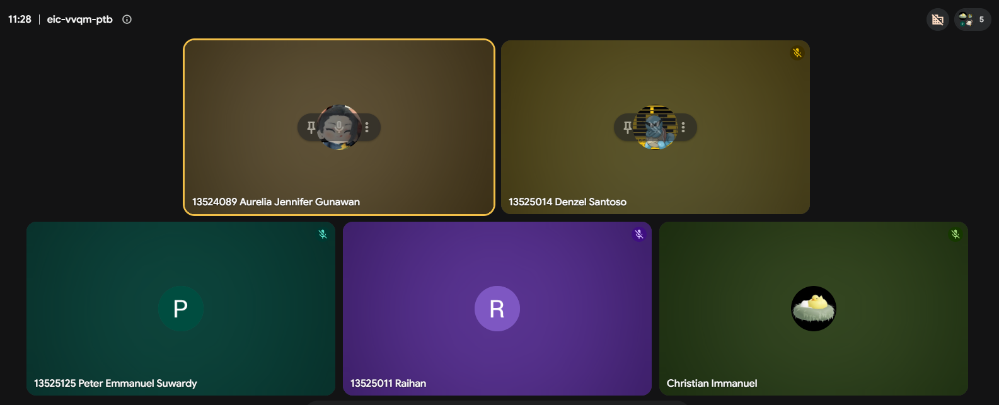

# Form Asistensi

## Tugas Besar IF2150 - Rekayasa Perangkat Lunak

| Informasi | Keterangan |
| --- | --- |
| **Hari** | *Rabu* |
| **Tanggal** | *16/09/2026* |
| **Kelas** | *K2* |
| **Nomor Kelompok** | *G01*  |
| **Nama Kelompok** | *Swike Karang Anyer*  |
| **Nama Perangkat Lunak** | *SeaGuard*  |
| **Dokumen** | *K02_G01_UC.md*  |

### Anggota Kelompok

| NIM | Nama |
| --- | --- |
| *13525104* | *Jeremy Gerald Sutanto* |
| *13525116* | *Christian Immanuel* |
| *13525014* | *Denzel Santoso* |
| *13525011* | *Raihan* |
| *13525125* | *Peter Emmanuel Suwardy* |

### Catatan

| Catatan |
| --- |
| 1. 2: KF13 dan KF23 dihapus dan dipindahkan ke Kebutuhan non fungsional |
| 2. 3.2: Menghapus UC08 dan menyesuaikan use case dengan KF yg dihapus |
| 3. 3.3: Menghapus UC08 dari diagram use case |
| 4. 3.4.1: Memperbaiki penulisan dan menambahkan error message di skenario alternatif 2 |
| 5. 3.4.2: Menyeseuaikan skenario use case dengan KF07 |
| 6. 3.4.8: Menghapus skenario UC08 |

## Dokumentasi

<!--  -->

  

  <i>Gambar 1. Dokumentasi kegiatan asistensi.</i>

