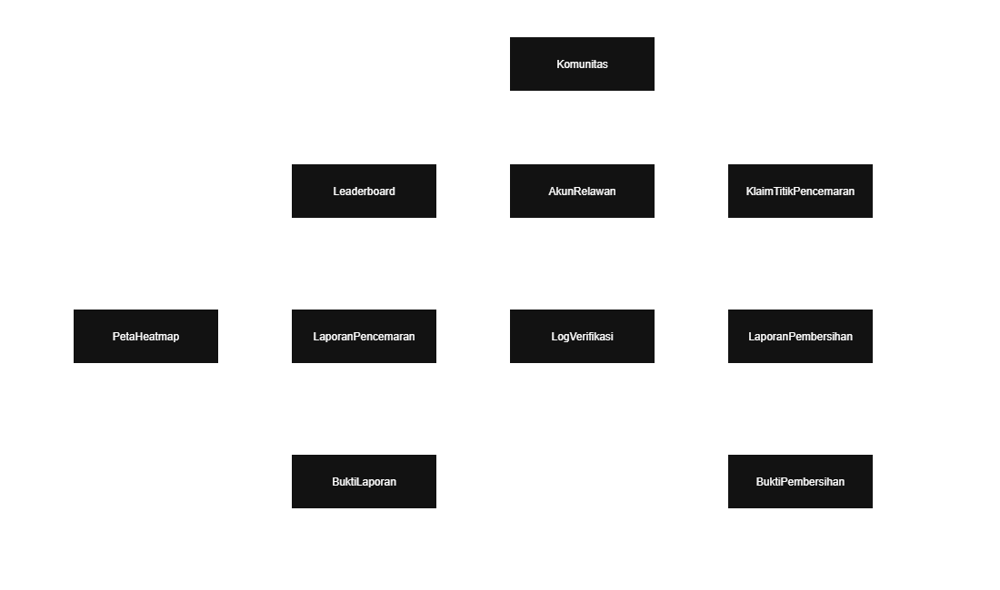

<h1>
IF2150 REKAYASA PERANGKAT LUNAK
 
TUGAS 5
 
SPESIFIKASI KEBUTUHAN PERANGKAT LUNAK (SKPL)
</h1>
 

## *SeaGuard*

### Untuk: *Aurelia Jennifer Gunawan*

Dipersiapkan oleh:
| Informasi | Keterangan |
| --- | --- |
| Kelas | *K02* |
| Kelompok | *G01*  |

| NIM | Nama |
|---|---|
| *13525104* | *Jeremy Gerald Sutanto* |
| *13525116* | *Christian Immanuel* |
| *13525014* | *Denzel Santoso* |
| *13525011* | *Raihan* |
| *13525125* | *Peter Emmanuel Suwardy* |
---

## Daftar Perubahan

Tidak ada perubahan dari milestone 4

 

# BAB 1: Pendahuluan

## 1.1 Tujuan Penulisan Dokumen
Dokumen Spesifikasi Kebutuhan Perangkat Lunak (SKPL) merupakan dokumen yang bertujuan sebagai acuan atau panduan untuk pengembang dan pengguna perangkat lunak selama dalam pengembangan perangkat lunak yang akan dibangun. Dokumen SKPL ini berisi spesifikasi kebutuhan dari perangkat lunak bernama SeaGuard yang akan dikembangkan. Perangkat lunak SeaGuard merupakan aplikasi berbasis web bagi Relawan untuk memantau dan melaporkan kondisi pencemaran di wilayah-wilayah perairan Indonesia.

## 1.2 Lingkup Masalah
SeaGuard merupakan perangkat lunak berbasis web yang digunakkan untuk memantau dan memberikan data mengenai kondisi sampat laut di suatu wilayah di Indonesia. Berdasarkan publikasi dari World Bank Group (WBG, 2021), Indonesia menghasilkan sebanyak 7,8 juta ton sampah plastik memasukin lautan global setiap tahunnya. Diperkirakan rentang antara 201,1 - 552,3 kilo ton sampah plastik per tahun dibuang ke dalam ekosistem laut yang bersumber dari daratan, di mana 2 per 3 sampah tersebut berasal dari Jawa dan Sumatera. Urgensi penanganan masalah ini sangat tinggi karena limbah plastik tersebut dapat membahayakan maritim laut dan manusia. Oleh karena itu, diperlukan penanganan melalui software berbentuk gamifikasi untuk menarik perhatian masyarakat dari berbagai daerah di Indonesia untuk ikut berkontribusi dalam membersihkan sampah laut tersebut.

## 1.3 Definisi, Istilah, dan Singkatan

Tabel 1.3. Definisi Istilah dan Singkatan

| Singkatan, Akronim, atau Istilah | Penjelasan |
| :--- | :--- |
| *P/L* | *Singkatan dari Perangkat Lunak, yaitu aplikasi yang memberikan perintah kepada komputer untuk menjalankan tugas tertentu.* |
| *SKPL* | *Singkatan dari Spesifikasi Kebutuhan Perangkat Lunak, yaitu dokumen yang merangkum kriteria-kriteria yang diperlukan untuk membangun aplikasi menjalankan tugasnya.* |
| *KF* | *Singkatan dari Kebutuhan Fungsional.* |
| *KNF* | *Singkatan dari Kebutuhan Non-Fungsional.* |
| *UC* | *Singkatan dari Use Case.* |
| *EARS* | *Easy Approach to Requirements Syntax, yaitu pola penulisan kebutuhan agar konsisten dan mudah diuji.* |

## 1.4 Aturan Penomoran

Tabel 1.4. Aturan Penomoran

| Hal/Bagian | Penomoran | Keterangan |
| :--- | :--- | :--- |
| *Kebutuhan Fungsional* | *KFXX* | Diawali "KF" diikuti dengan dua digit yang terurut dari KF01 hingga KF21. Setiap KF terhubung dengan satu ID kebutuhan. |
| *Kebutuhan Non-Fungsional* | *KNFXX* | Diawali "KNF" diikuti dengan dua digit yang terurut dari KNF01 hingga KNF012. Setiap KNF terhubung dengan satu ID kebutuhan dan satu parameter. |
| *Aktor* | *AXX* | 	Diawali "A" diikuti dengan dua digit yang terurut dari A01 hingga A02. |
| *Use Case* | *UCXX* | Diawali "UC" diikuti dengan dua digit yang terurut dari UC01 hingga UC08. Setiap UC terhubung dengan KF yang berkaitan. |
| *Kelas* | *CXX* | Diawali "C" diikuti dengan dua digit yang terurut dari C01 hingga C10. Setiap kelas terhubung dengan UC yang berkaitan. |

## 1.5 Referensi
Dokumentasi yang dirujuk dalam penyusunan dokumen SKPL ini meliputi:
1. Sommerville, I. (2015). *Software Engineering* (10th ed.). Pearson.
2. Laboratorium Rekayasa Perangkat Lunak. (2026). *Asistensi Akbar Tugas 4: Class Diagram*. IF2150 Rekayasa Perangkat Lunak.

## 1.6 Deskripsi Umum Dokumen (Ikhtisar)
Sistematika Dokumen SKPL ini disusun sebagai berikut:
- **BAB 1: Pendahuluan** - Membahas latar belakang, tujuan penulisan dokumen, lingkup masalah, definisi istilah/singkatan, aturan penomoran, referensi, serta sistematika penulisan dokumen SKPL.

- **BAB 2: Deskripsi Perangkat Lunak** - Membahas deskripsi umum mengenai sistem dan perangkat lunak beserta lingkup interaksinya, karakteristik pengguna (aktor) dan kebutuhan pengguna, batasan perangkat lunak, serta spesifikasi lingkungan operasi tempat perangkat lunak dijalankan.

- **BAB 3: Deskripsi Kebutuhan Perangkat Lunak** - Membahas mengenai Kebutuhan Fungsional (KF) dan Kebutuhan Non Fungsional (KNF) yang ditulis sesuai format EARS.

- **BAB 4: Pemodelan Use Case** - Membahas mengenai pemodelan use case yang berisi identifikasi aktor dan use case, diagram use case, dan skenario setiap use case.

- **BAB 5: Pemodelan Kelas** - Membahas mengenai identifikasi kelas beserta dengan diagram kelas setiap use case.

- **BAB 6: Traceability** - Membahas traceability penghubung kelas, use case, dan kebutuhan fungsional.

---

# BAB 2: Deskripsi Perangkat Lunak

## 2.1 Deskripsi Umum Sistem

SeaGuard merupakan aplikasi berbasis web bagi Relawan untuk memantau dan melaporkan kondisi pencemaran di wilayah-wilayah perairan Indonesia. Pengguna dapat memperoleh ringkasan mengenai parameter terkini beserta rentang kualitas perairan yang sehat, waspada, dan berbahaya, serta melihat heatmap yang memvisualisasikan persebaran polusi laut dan tingkat pencemarannya di suatu wilayah. Pengguna dapat melaporkan data pencemaran baru beserta buktinya pada wilayah tertentu, yang kemudian diverifikasi oleh Verifikator/Admin sebelum ditampilkan sepenuhnya pada heatmap publik. Berdasarkan data yang sudah tersedia, Pengguna juga dapat mengklaim dan membersihkan wilayah yang dikategorikan memiliki tingkat pencemaran tinggi atau membutuhkan penanganan. Setelah pembersihan selesai, Pengguna mengirimkan laporan beserta bukti sebelum dan sesudah untuk diverifikasi kembali oleh Verifikator/Admin. Setiap kontribusi yang telah diverifikasi akan dinilai berdasarkan skor yang ditentukan sistem, dan Pengguna dapat melihat leaderboard yang menampilkan peringkat antar Pengguna berdasarkan skor tersebut.

<i>Gambar 1. Contoh Activity Diagram Proses Bisnis</i>

## 2.2 Deskripsi Umum Perangkat Lunak
Diisi dengan deskripsi umum perangkat lunak untuk mendukung proses bisnis yang telah diuraikan pada sub-bab sebelumnya. Uraian harus menunjukkan lingkup perangkat lunak, mencakup keterkaitan perangkat lunak dengan sistem lain di luar (misalnya *Payment Gateway* atau layanan pihak ketiga lain yang dipakai).

*Contoh narasi:* "*[Nama P/L]* merupakan aplikasi *[deskripsi singkat]* yang berinteraksi dengan *Payment Gateway (dummy)* untuk memproses otorisasi pembayaran. Sistem menerima input dari *Pelanggan* melalui antarmuka aplikasi dan mengirimkan permintaan transaksi ke *Payment Gateway* setiap kali pelanggan melakukan checkout."

## 2.3 Pengguna dan Kebutuhan Pengguna Perangkat Lunak
| Aktor | Deskripsi |
| :--- | :--- |
| *Relawan* | *Pengguna umum (masyarakat/mahasiswa/komunitas peduli lingkungan) yang melaporkan titik sampah, memantau heatmap, mengklaim titik untuk dibersihkan, dan mengunggah bukti pembersihan. Karakteristiknya mengutamakan kemudahan pelaporan dan motivasi berupa skor/kompetisi.* |
| *Verifikator/Admin* | *Pengelola sistem (bisa dari pihak Dinas Lingkungan Hidup, koordinator komunitas, atau tim internal) yang bertugas memvalidasi kebenaran laporan sampah dan bukti pembersihan sebelum skor diberikan. Karakteristiknya mengutamakan akurasi data agar sistem tidak disalahgunakan (laporan palsu/klaim curang).* |

## 2.4 Batasan Perangkat Lunak
Batasan yang harus dituliskan, di antaranya:
1. *SeaGuard harus berfungsi pada platform web browser modern*
2. *SeaGuard harus menerima format data pdf untuk laporan dan png/jpg/jpeg untuk bukti foto.*
3. *SeaGuard hanya dapat digunakan saat terhubung ke internet karena pengiriman laporan dilakukan secara daring*
4. *SeaGuard hanya bergantung dari data laporan pengguna dan bukti foto yang dilampirkan*
5. *SeaGuard hanya memberi data pencemaran yang terbatas pada wilayah tertentu yang ditentukan*

## 2.5 Lingkungan Operasi Perangkat Lunak
Spesifikasi *operating system* atau lingkungan yang dibutuhkan P/L untuk beroperasi. Bagian ini digunakan untuk memastikan pengguna memiliki spesifikasi yang cukup untuk menjalankan P/L. Misalnya mencakup komponen server, client, OS, DBMS, tetapi tidak menutupi kemungkinan komponen lain.

| Komponen | Spesifikasi |
| :--- | :--- |
| *Server* | *[contoh: Node.js v20, dijalankan pada layanan cloud]* |
| *Client* | *[contoh: Web Browser modern (Chrome, Firefox terbaru)]* |
| *DBMS* | *[contoh: PostgreSQL 15]* |
| *OS* | *[contoh: Cross-platform (Windows/Linux/MacOS) melalui browser]* |
| *...* | *...* |

---

# BAB 3: Deskripsi Kebutuhan Perangkat Lunak

## 3.1 Kebutuhan Fungsional (KF)

Tabel 3.1. Kebutuhan Fungsional

| ID KF | ID Kebutuhan | Penjelasan |
| :--- | :--- | :--- |
| *KF01* | *R01* | *Ketika pengguna membuka fitur pelaporan, perangkat lunak harus menyediakan form dengan field unggah foto, pilihan indikator kualitatif tingkat pencemaran, dan kolom koordinat lokasi.* |
| *KF02* | *R01* | *Ketika pengguna mengizinkan akses lokasi, perangkat lunak dapat mengambil koordinat GPS secara otomatis dari perangkat pengguna melalui fitur geolocation pada browser.* |
| *KF03* | *R03* | *Ketika foto diunggah, perangkat lunak harus memvalidasi ukuran berkas (maksimal 5 MB) dan format berkas (JPG/PNG) sebelum diproses lebih lanjut.* |
| *KF04* | *R03* | *Jika tersedia metadata EXIF pada foto yang diunggah, perangkat lunak harus mengekstrak metadata tersebut untuk keperluan verifikasi lokasi laporan.* |
| *KF05* | *R04* | *Ketika pengguna mengakses fitur yang memerlukan kamera atau data lokasi untuk pertama kali, perangkat lunak harus menampilkan dialog persetujuan (consent) kepada pengguna.* |
| *KF06* | *R05* | *Ketika pengguna mengakses tampilan peta, perangkat lunak harus menampilkan peta heatmap persebaran polusi laut dengan pewarnaan berdasarkan kategori kualitas perairan (sehat, waspada, berbahaya).* |
| *KF07* | *R05* | *Ketika pengguna mengakses tampilan peta, perangkat lunak harus menyediakan jenis kategori (sehat, waspada, berbahaya) dan fitur filter tampilan peta berdasarkan tingkat pencemaran.* |
| *KF08* | *R07* | *Ketika data laporan terverifikasi, perangkat lunak harus mengagregasi data laporan berdasarkan koordinat geospasial untuk menghitung skor kepanasan (heat intensity) tiap klaster titik.* |
| *KF09* | *R08* | *Ketika Verifikator membuka dashboard, perangkat lunak harus menyediakan antrean laporan yang menampilkan foto, lokasi, dan status tiap laporan.* |
| *KF10* | *R08* | *Ketika Verifikator mengecek laporan, perangkat lunak harus memungkinkan Verifikator mengubah status laporan menjadi "Disetujui" atau "Ditolak".* |
| *KF11* | *R10* | *Ketika status laporan diperbarui oleh Verifikator, perangkat lunak harus mengirimkan notifikasi in-app secara real-time kepada Relawan.* |
| *KF12* | *R11* | *Ketika relawan memilih titik pencemaran, perangkat lunak harus menyediakan fitur klaim (lock) titik lokasi pencemaran pada peta.* |
| *KF13* | *R14* | *Ketika relawan akan melaporkan pembersihan, perangkat lunak harus menyediakan form unggah bukti pembersihan berupa foto sebelum dan sesudah beserta deskripsi singkat kegiatan.* |
| *KF14* | *R16* | *Ketika bukti pembersihan diunggah, perangkat lunak harus memvalidasi koordinat GPS pada foto bukti pembersihan agar berada dalam radius maksimal 100 meter dari titik klaim (geofencing).* |
| *KF15* | *R17* | *Ketika Verifikator meninjau bukti pembersihan, perangkat lunak harus menampilkan perbandingan foto before dan after secara berdampingan.* |
| *KF16* | *R17* | *Ketika Verifikator selesai menilai, perangkat lunak harus memungkinkan Verifikator untuk menyetujui atau menolak pengajuan klaim pembersihan.* |
| *KF17* | *R19* | *Ketika tindakan verifikasi dilakukan, perangkat lunak harus mencatat log audit setiap tindakan verifikasi yang mencakup ID Verifikator, status keputusan, dan stempel waktu.* |
| *KF18* | *R20* | *Ketika pengguna membuka halaman peringkat, perangkat lunak harus menampilkan total akumulasi poin kontribusi pengguna beserta posisi pada papan peringkat (leaderboard).* |
| *KF19* | *R22* | *Ketika aksi pembersihan tervalidasi, perangkat lunak harus menghitung ulang skor pengguna dan memperbarui urutan leaderboard secara otomatis.* |
| *KF20* | *R23* | *Ketika Admin mengakses panel admin, perangkat lunak harus menyediakan fitur untuk mengelola akun pengguna, mengubah hak akses peran, dan menangguhkan akun yang bermasalah.* |
| *KF21* | *R23* | *Ketika Admin memperbarui data komunitas, perangkat lunak harus menyimpan perubahan data komunitas tersebut.* |

## 3.2 Kebutuhan Non-Fungsional (KNF)

Tabel 3.2. Kebutuhan Non-Fungsional

| ID KNF | ID Kebutuhan | Parameter | Deskripsi Kebutuhan |
| :--- | :--- | :--- | :--- |
| *KNF01* | *R03* | *Reliability* | *Bila terjadi gangguan jaringan sementara saat unggah foto, maka sistem harus menjaga konsistensi foto laporan dengan melakukan retry otomatis maksimal 3 kali.* |
| *KNF02* | *R04* | *Security* | *Ketika pengguna memberi persetujuan akses lokasi dan kamera, sistem harus menyimpan catatan consent log sesuai ketentuan UU PDP.* |
| *KNF03* | *R07* | *Response time* | *Ketika sistem merender layer heatmap hingga 10.000 titik laporan, sistem harus menyelesaikan proses dalam waktu maksimal 3 detik.* |
| *KNF04* | *R10* | *Response time* | *Ketika status laporan diperbarui oleh Verifikator, sistem harus memastikan notifikasi in-app dikirimkan dan diterima oleh pengguna dalam waktu maksimal 5 detik.* |
| *KNF05* | *R13* | *Reliability* | *Ketika dua atau lebih klaim dilakukan pada titik dan waktu yang sama, sistem harus menerapkan mekanisme locking untuk mencegah klaim ganda (zero race condition).* |
| *KNF06* | *R16* | *Reliability* | *Ketika melakukan validasi geofencing, sistem harus memiliki toleransi kesalahan maksimal 10 meter dari radius 100 meter yang ditentukan.* |
| *KNF07* | *R19* | *Security* | *Sistem harus memastikan log audit tindakan verifikasi bersifat immutable (tidak dapat diubah/dihapus selain oleh Admin sistem).* |
| *KNF08* | *R22* | *Response time* | *Ketika aksi pembersihan disetujui Verifikator, sistem harus memperbarui leaderboard ke seluruh pengguna dalam waktu maksimal 10 detik.* |
| *KNF09* | *R25* | *Security* | *Bila pengguna mengalami gagal login 5 kali berturut-turut, maka sistem harus mengunci akun sementara selama 15 menit.* |
| *KNF10* | *R05* | *Ergonomy* | *Ketika pengguna awam mengakses tampilan heatmap, sistem harus menampilkan heatmap dan legenda kategori kualitas perairan yang dapat dipahami tanpa memerlukan pelatihan khusus.* |
| *KNF11* | *R07* | *Availability* | *Selama operasional bulanan berjalan, aplikasi web Seaguard harus menyediakan tingkat ketersediaan (uptime) minimal 99%.* |
| *KNF12* | *R01* | *Portability* | *Ketika diakses melalui browser modern versi dua tahun terakhir, aplikasi web Seaguard harus dapat berjalan dan berfungsi dengan baik.* |

| Parameter | Penjelasan |
| :--- | :--- |
| *Availability* | Ketersediaan aplikasi, misalnya harus terus-menerus beroperasi 7 hari per minggu, 24 jam per hari tanpa gagal. |
| *Reliability* | Keandalan, misalnya tidak pernah boleh gagal (atau kegagalan yang ditolerir adalah …%) sehingga harus dipikirkan *fault tolerant architecture*. Biasanya hanya perlu untuk *critical application* yang jika gagal akan berakibat fatal. |
| *Ergonomy* | Kenyamanan pakai bagi pengguna. |
| *Portability* | Kemudahan untuk dibawa dan dioperasikan ke mesin/sistem operasi/*platform* yang lain. |
| *Memory* | Jika perhitungan kapasitas memori internal kritis (misalnya untuk P/L yang harus dijadikan *chips* dan ukurannya harus kecil). |
| *Response time* | Batasan waktu yang harus dipenuhi. Sangat penting untuk aplikasi *real time*. Contoh: "Aplikasi harus mampu menampilkan hasil dalam 4 detik", atau "ATM harus menarik kembali kartu yang tidak diambil dalam waktu 3 menit". |
| *Safety* | Yang menyangkut keselamatan manusia, misalnya untuk P/L yang dipakai pada sistem kontrol di pabrik. |
| *Security* | Aspek keamanan yang harus dipenuhi. |

---

# BAB 4: Pemodelan Use Case

## 4.1 Identifikasi Aktor

| ID Aktor | Aktor | Deskripsi |
| :--- | :--- | :--- |
| *A01* | *Relawan* | *Pengguna umum (masyarakat/mahasiswa/komunitas peduli lingkungan) yang melaporkan titik sampah, memantau heatmap, mengklaim titik untuk dibersihkan, dan mengunggah bukti pembersihan. Karakteristiknya mengutamakan kemudahan pelaporan dan motivasi berupa skor/kompetisi.* |
| *A02* | *Verifikator/Admin* | *Pengelola sistem (bisa dari pihak Dinas Lingkungan Hidup, koordinator komunitas, atau tim internal) yang bertugas memvalidasi kebenaran laporan sampah dan bukti pembersihan sebelum skor diberikan. Karakteristiknya mengutamakan akurasi data agar sistem tidak disalahgunakan (laporan palsu/klaim curang).* |

## 4.2 Identifikasi Use Case
| ID UC | Nama Use Case | Deskripsi Singkat | Aktor Terlibat | ID KF Terkait |
| :--- | :--- | :--- | :--- | :--- |
| *UC01* | *Melaporkan Titik Pencemaran* | *Relawan melaporkan titik pencemaran di wilayah tertentu dan melampirkan buktinya* | *Relawan* | *KF01, KF02, KF03, KF04, KF05* |
| *UC02* | *Melihat Data dan Heatmap Pencemaran* | *Relawan dapat melihat sejumlah parameter pencemaran dan tingkat polusi perairan melalui heatmap yang disediakan aplikasi* | *Relawan* | *KF06, KF07, KF08* |
| *UC03* | *Memverifikasi Laporan Pencemaran* | *Admin memverifikasi lebih lanjut bukti laporan pencemaran yang telah diupload ke aplikasi untuk memvalidasikan informasi yang diberikan relawan* | *Verifikator / Admin* | *KF09, KF10, KF11* |
| *UC04* | *Mengklaim Titik Pencemaran* | *Relawan dapat mengklaim titik pencemaran supaya wilayah yang diklaim itu dapat dibersihkan* | *Relawan* | *KF12* |
| *UC05* | *Melaporkan Hasil Pembersihan* | *Relawan melaporkan hasil pembersihan yang telah dilakukan di wilayah tersebut dan melampirkan bukti pembersihannya* | *Relawan* | *KF13, KF14* |
| *UC06* | *Memverifikasi Hasil Pembersihan* | *Admin memverifikasi lagi bukti foto sebelum pembersihan dan setelah pembersihan untuk memvalidasikan hasil pembersihan relawan* | *Verifikator / Admin* | *KF15, KF16, KF17* |
| *UC07* | *Melihat Leaderboard* | *Relawan dapat melihat leaderboard beserta skornya berdasarkan hasil pembersihan yang telah dilakukan* | *Relawan* | *KF18* |
| *UC08* | *Mengelola Akun Relawan dan Data Komunitas* | *Admin mengelola data akun relawan dan komunitas serta mengatasi akun yang sedang bermasalah* | *Verifikator / Admin* | *KF20, KF21* |

## 4.3 Use Case Diagram
Salin ulang Use Case Diagram dari BAB 3.3 dokumen *Use Case & Scenario Use Case* atau *Class Diagram* (gunakan versi paling akhir/terbaru apabila terdapat perubahan).

<i>Gambar 2. Use Case Diagram</i>

## 4.4 Skenario Use Case
### 4.4.1 Skenario UC01

**Nama Use Case:** *Melaporkan Titik Pencemaran*

**Skenario Normal**

| No | Aksi Aktor | Reaksi Perangkat Lunak |
| :--- | :--- | :--- |
| 1 | *Relawan membuka menu pelaporan* | *Sistem menampilkan form laporan* |
| 2 | *Relawan mengisi laporan pencemaran* | *Sistem menyimpan laporan yang disimpan pengguna* |
| 3 | *Relawan melampirkan bukti pencemaran* | *Sistem menyimpan bukti yang disimpan pengguna* |
| 4 | *Relawan mengupload laporan ke sistem* | *Sistem mengupload laporan beserta buktinya ke database* |

 

**Skenario Alternatif 1: Upload Laporan Gagal**

| No | Aksi Aktor | Reaksi Perangkat Lunak |
| :--- | :--- | :--- |
| 1 | *Relawan membuka menu pelaporan* | *Sistem menampilkan form laporan* |
| 2 | *Relawan mengisi laporan pencemaran* | *Sistem menerima laporan pencemaran dengan format yang tidak sesuai. Sistem menampilkan error message dan meminta relawan untuk mengupload laporan dengan format yang sesuai* |
| 3 | *Relawan merevisi format laporan* | *Sistem kembali ke langkah 2* |

**Skenario Alternatif 2: Upload Bukti Foto Gagal**

| No | Aksi Aktor | Reaksi Perangkat Lunak |
| :--- | :--- | :--- |
| 1 | *Relawan membuka menu pelaporan* | *Sistem menampilkan form laporan* |
| 2 | *Relawan mengisi laporan pencemaran* | *Sistem menyimpan laporan yang disimpan pengguna* |
| 3 | *Relawan melampirkan bukti pencemaran* | *Sistem menerima bukti dengan format yang tidak sesuai. Sistem menampilkan error message dan meminta relawan untuk mengupload bukti dengan format yang sesuai* |
| 4 | *Relawan merevisi format bukti foto* | *Sistem kembali ke langkah 3* |

### 4.4.2 Skenario UC02

**Nama Use Case:** *Melihat Data dan Heatmap Pencemaran*

**Skenario Normal**

| No | Aksi Aktor | Reaksi Perangkat Lunak |
| :--- | :--- | :--- |
| 1 | *Relawan membuka menu heatmap* | *Sistem menampilkan peta heatmap persebaran polusi laut lengkap beserta jenis kategori (sehat, waspada, berbahaya)* |
| 2 | *Relawan memilih filter tampilan peta berdasarkan tingkat pencemaran tertentu* | *Sistem memperbarui tampilan peta heatmap sesuai dengan filter tingkat pencemaran yang dipilih* |
| 3 | *Relawan menginput lokasi spesifik yang ingin dicari* | *Sistem mencari dan menampilkan peta lokasi yang dicari* |
| 4 | *Relawan membuka detail data pencemaran pada titik tersebut* | *Sistem menampilkan data parameter pencemaran di lokasi yang dipilih* |

 

**Skenario Alternatif 1: Lokasi Tidak Ditemukan**

| No | Aksi Aktor | Reaksi Perangkat Lunak |
| :--- | :--- | :--- |
| 1 | *Relawan menginput lokasi spesifik yang ingin dicari* | *Sistem tidak menemukan lokasi yang sesuai dan menampilkan pesan "Lokasi tidak ditemukan"* |
| 2 | *Relawan menginput ulang lokasi pencarian yang valid* | *Sistem kembali ke langkah 3 pada Skenario Normal* |

 

**Skenario Alternatif 2: Hasil Filter Kosong**

| No | Aksi Aktor | Reaksi Perangkat Lunak |
| :--- | :--- | :--- |
| 1 | *Relawan memilih filter berdasarkan tingkat pencemaran tertentu* | *Sistem mendeteksi tidak ada titik laporan dengan kategori tersebut pada area peta saat ini, lalu menampilkan pesan "Tidak ada data untuk tingkat pencemaran ini"* |
| 2 | *Relawan menghapus atau mengubah pilihan filter* | *Sistem kembali ke langkah 2 pada Skenario Normal* |

### 4.4.3 Skenario UC03

**Nama Use Case:** *Memverifikasi Laporan Pencemaran*

**Skenario Normal**

| No | Aksi Aktor | Reaksi Perangkat Lunak |
| :--- | :--- | :--- |
| 1 | *Verifikator membuka dashboard* | *Sistem menampilkan antrean laporan beserta foto, lokasi, dan status tiap laporan* |
| 2 | *Verifikator memilih salah satu laporan untuk diperiksa* | *Sistem menampilkan detail laporan yang dipilih* |
| 3 | *Verifikator mengubah status laporan menjadi "Disetujui"/"Ditolak"* | *Sistem menyimpan perubahan status laporan dan mengirimkan notifikasi in-app secara real-time kepada Relawan* |

### 4.4.4 Skenario UC04

**Nama Use Case:** *Mengklaim Titik Pencemaran*

**Skenario Normal**

| No | Aksi Aktor | Reaksi Perangkat Lunak |
| :--- | :--- | :--- |
| 1 | *Relawan memilih titik pencemaran pada peta* | *Sistem menampilkan detail titik pencemaran beserta opsi klaim* |
| 2 | *Relawan menekan tombol klaim* | *Sistem mengunci titik tersebut sebagai milik relawan yang bersangkutan* |

 

**Skenario Alternatif 1: Titik Sudah Diklaim**

| No | Aksi Aktor | Reaksi Perangkat Lunak |
| :--- | :--- | :--- |
| 1 | *Relawan memilih titik yang sudah diklaim relawan lain* | *Sistem menampilkan status titik sebagai sudah diklaim* |
| 2 | *Relawan menekan tombol klaim* | *Sistem menolak aksi dan menampilkan pesan titik sudah diklaim pengguna lain* |

**Skenario Alternatif 2: Klaim Bersamaan pada Titik yang Sama**

| No | Aksi Aktor | Reaksi Perangkat Lunak |
| :--- | :--- | :--- |
| 1 | *Dua relawan menekan tombol klaim pada titik yang sama secara bersamaan* | *Sistem menerapkan mekanisme locking pada basis data transaksi klaim* |
| 2 | *Kedua relawan menunggu hasil proses* | *Sistem hanya memproses satu permintaan klaim, mengunci titik untuk relawan yang klaimnya berhasil diproses dan menampilkan pesan gagal pada relawan yang klaimnya tidak diproses* |

### 4.4.5 Skenario UC05

**Nama Use Case:** *Melaporkan Hasil Pembersihan*

**Skenario Normal**

| No | Aksi Aktor | Reaksi Perangkat Lunak |
| :--- | :--- | :--- |
| 1 | *Relawan membuka menu pelaporan pembersihan* | *Sistem menampilkan form unggah bukti pembersihan dengan field foto sebelum, foto sesudah, dan deskripsi kegiatan* |
| 2 | *Relawan mengunggah foto sebelum dan sesudah beserta deskripsi* | *Sistem memvalidasi koordinat GPS foto berada dalam radius 100 meter dari titik klaim* |
| 3 | *Relawan mengirim laporan pembersihan* | *Sistem menyimpan laporan dan mengubah status klaim menjadi "Menunggu Verifikasi"* |

 

**Skenario Alternatif 1: Lokasi Foto di Luar Radius Geofencing**

| No | Aksi Aktor | Reaksi Perangkat Lunak |
| :--- | :--- | :--- |
| 1 | *Relawan membuka menu pelaporan pembersihan* | *Sistem menampilkan form unggah bukti pembersihan dengan field foto sebelum, foto sesudah, dan deskripsi kegiatan* |
| 2 | *Relawan mengunggah foto sebelum dan sesudah beserta deskripsi* | *Sistem mendeteksi koordinat GPS pada foto berada di luar radius 100 meter dari titik klaim dan menampilkan pesan error* |
| 3 | *Relawan mengunggah ulang foto bukti dengan lokasi yang sesuai* | *Sistem kembali ke langkah 2 pada skenario normal* |

### 4.4.6 Skenario UC06

**Nama Use Case:** *Memverifikasi Hasil Pembersihan*

**Skenario Normal**

| No | Aksi Aktor | Reaksi Perangkat Lunak |
| :--- | :--- | :--- |
| 1 | *Verifikator membuka daftar pengajuan pembersihan* | *Sistem menampilkan daftar klaim pembersihan yang menunggu verifikasi* |
| 2 | *Verifikator memilih salah satu pengajuan* | *Sistem menampilkan perbandingan foto before-after secara berdampingan dan deskripsi kegiatannya* |
| 3 | *Verifikator menyetujui atau menolak hasil pembersihan* | *Sistem menyimpan keputusan status, mencatat log audit, dan mengirim notifikasi pada Relawan* |

### 4.4.7 Skenario UC07

**Nama Use Case:** *Melihat Leaderboard*

**Skenario Normal**

| No | Aksi Aktor | Reaksi Perangkat Lunak |
| :--- | :--- | :--- |
| 1 | *Relawan membuka menu leaderboard* | *Sistem menampilkan leaderboard pengguna beserta total poin kontribusi Relawan* |
| 2 | *Relawan melihat daftar peringkat* | *Sistem menampilkan urutan leaderboard teratas dan informasi poinnya* |

 

**Skenario Alternatif 1: Gagal Memuat Leaderboard**

| No | Aksi Aktor | Reaksi Perangkat Lunak |
| :--- | :--- | :--- |
| 1 | *Relawan membuka menu leaderboard* | *Sistem mengalami kendala dan menampilkan pesan "Gagal memuat leaderboard"* |
| 2 | *Relawan menekan tombol refresh* | *Sistem mencoba kembali mengambil data leaderboard dan melanjutkan langkah 1 skenario normal* |

### 4.4.8 Skenario UC08

**Nama Use Case:** *Mengelola Akun Relawan dan Data Komunitas*

**Skenario Normal**

| No | Aksi Aktor | Reaksi Perangkat Lunak |
| :--- | :--- | :--- |
| 1 | *Admin membuka panel pengelolaan akun dan komunitas* | *Sistem menampilkan daftar akun, komunitas, dan hak akses* |
| 2 | *Admin memilih akun atau komunitas yang ingin diperbarui datanya* | *Sistem menampilkan detail informasi akun atau komunitas serta formulir perubahan data* |
| 3 | *Admin mengubah peran, menangguhkan akun, atau perbarui data* | *Sistem memvalidasi dan menyimpan perubahan data* |

 

**Skenario Alternatif 1: Pembaruan Data Gagal**

| No | Aksi Aktor | Reaksi Perangkat Lunak |
| :--- | :--- | :--- |
| 1 | *Admin selesai mengubah peran, menangguhkan akun atau perbarui data* | *Sistem mendeteksi kendala pada sistem dan menampilkan pesan "Gagal memperbarui data akun/komunitas"* |
| 2 | *Admin mencoba kembali konfirmasi perubahan data* | *Sistem mengulang langkah 3 skenario normal* |

---

# BAB 5: Pemodelan Kelas

## 5.1 Identifikasi Kelas

| ID Kelas | Nama Kelas | Deskripsi Kelas | ID Use Case |
| :--- | :--- | :--- | :--- |
| *C01* | *LaporanPencemaran* | *Menyimpan data laporan pencemaran seperti tingkat indikator, koordinat lokasi, dan waktu laporan.* | *UC01, UC02, UC03, UC04* |
| *C02* | *BuktiLaporan* | *Menyimpan bukti laporan pencemaran untuk proses verifikasi* | *UC01, UC03* |
| *C03* | *KlaimTitikPencemaran* | *Menyimpan informasi relawan pada titik pencemaran yang akan dibersihkan* | *UC04, UC05* |
| *C04* | *LaporanPembersihan* | *Menyimpan data hasil kegiatan pembersihan yang dilakukan oleh relawan* | *UC05, UC06* |
| *C05* | *BuktiPembersihan* | *Menyimpan bukti foto sebelum dan sesudah pembersihan untuk proses verifikasi* | *UC05, UC06* |
| *C06* | *LogVerifikasi* | *Menyimpan hasil verifikasi seperti identitas verifikator, keputusan, dan stempel waktu* | *UC03, UC06* |
| *C07* | *Leaderboard* | *Menyimpan dan menampilkan skor kontribusi dan peringkat relawan* | *UC07* |
| *C08* | *AkunRelawan* | *Menyimpan data profil relawan, total poin kontribusi, dan status akun* | *UC01, UC02, UC04, UC05, UC07, UC08* |
| *C09* | *Komunitas* | *Menyimpan data komunitas yang dikelola admin* | *UC08* |
| *C10* | *PetaHeatmap* | *Merepresentasikan tampilan visual polusi sampah di suatu lokasi* | *UC02* |

## 5.2 Diagram Kelas per Use Case
### 5.2.1 Use Case UC01

**Nama Use Case:** *Melaporkan Titik Pencemaran*

#### Identifikasi Kelas

| ID Kelas | Nama Kelas | Deskripsi Kelas |
| :--- | :--- | :--- |
| *C01* | *LaporanPencemaran* | *Menyimpan data utama laporan pencemaran sampah laut yang dikirim relawan.* |
| *C02* | *BuktiLaporan* | *Menyimpan dan memverifikasi bukti foto serta metadata EXIF bukti pencemaran.* |
| *C08* | *AkunRelawan* | *Profil relawan yang membuat dan mengirimkan laporan.* |

#### Diagram Kelas

<i>Gambar 3. Diagram Kelas Use Case UC01</i>

 

| ID Kelas | Nama Kelas | Atribut | Metode/Operasi |
| :--- | :--- | :--- | :--- |
| *C01* | *LaporanPencemaran* | *idLaporan, koordinatGPS, indikatorTingkat, tanggalLaporan, statusLaporan* | *buatLaporan(), setKoordinatGPS(), simpanLaporan()* |
| *C02* | *BuktiLaporan* | *idBukti, fotoUrl, ukuranFile, formatFile, metadataEXIF* | *validasiFormatUkuran(), ekstrakMetadataEXIF()* |
| *C08* | *AkunRelawan* | *idRelawan, nama, email* | *kirimLaporanPencemaran()* |

---

### 5.2.2 Use Case UC02

**Nama Use Case:** *Melihat Data dan Heatmap Pencemaran*

#### Identifikasi Kelas

| ID Kelas | Nama Kelas | Deskripsi Kelas |
| :--- | :--- | :--- |
| *C01* | *LaporanPencemaran* | *Sumber data titik-titik pencemaran terverifikasi yang ditampilkan pada peta.* |
| *C10* | *PetaHeatmap* | *Mengagregasi data lokasi untuk kalkulasi heat intensity dan pemfilteran kategori.* |

#### Diagram Kelas

<i>Gambar 4. Diagram Kelas Use Case UC02</i>

 

| ID Kelas | Nama Kelas | Atribut | Metode/Operasi |
| :--- | :--- | :--- | :--- |
| *C01* | *LaporanPencemaran* | *idLaporan, koordinatGPS, indikatorTingkat, statusLaporan* | *getDetailPencemaran(), getLokasiGPS()* |
| *C10* | *PetaHeatmap* | *idKlaster, koordinatPusat, heatIntensity, kategoriKualitas* | *hitungHeatIntensity(), filterBerdasarkanKategori(), tampilkanHeatmap()* |

---

### 5.2.3 Use Case UC03

**Nama Use Case:** *Memverifikasi Laporan Pencemaran*

#### Identifikasi Kelas

| ID Kelas | Nama Kelas | Deskripsi Kelas |
| :--- | :--- | :--- |
| *C01* | *LaporanPencemaran* | *Laporan yang ditinjau dan diperbarui statusnya oleh verifikator.* |
| *C02* | *BuktiLaporan* | *Foto dan metadata laporan yang diperiksa keabsahannya.* |
| *C06* | *LogVerifikasi* | *Mencatat histori tindakan peninjauan dan keputusan verifikator.* |
| *C08* | *AkunRelawan* | *Menyimpan informasi akun relawan yang mengirimkan laporan pencemaran.* |

#### Diagram Kelas

<i>Gambar 5. Diagram Kelas Use Case UC03</i>

 

| ID Kelas | Nama Kelas | Atribut | Metode/Operasi |
| :--- | :--- | :--- | :--- |
| *C01* | *LaporanPencemaran* | *idLaporan, statusLaporan* | *perbaruiStatusLaporan()* |
| *C02* | *BuktiLaporan* | *idBukti, fotoUrl, metadataEXIF* | *getDetailBukti()* |
| *C06* | *LogVerifikasi* | *idLog, idVerifikator, statusKeputusan, timestamp* | *catatLogVerifikasi()* |
| *C08* | *AkunRelawan* | *idRelawan, nama, email* | *getDataRelawan()* |

---

### 5.2.4 Use Case UC04

**Nama Use Case:** *Mengklaim Titik Pencemaran*

#### Identifikasi Kelas

| ID Kelas | Nama Kelas | Deskripsi Kelas |
| :--- | :--- | :--- |
| *C01* | *LaporanPencemaran* | *Titik lokasi pencemaran yang akan diklaim oleh relawan.* |
| *C03* | *KlaimTitikPencemaran* | *Objek transaksi penguncian titik lokasi untuk mencegah klaim ganda.* |
| *C08* | *AkunRelawan* | *Relawan yang melakukan pengklaiman titik.* |

#### Diagram Kelas

<i>Gambar 6. Diagram Kelas Use Case UC04</i>

 

| ID Kelas | Nama Kelas | Atribut | Metode/Operasi |
| :--- | :--- | :--- | :--- |
| *C01* | *LaporanPencemaran* | *idLaporan, statusLaporan* | *setStatusDiklaim()* |
| *C03* | *KlaimTitikPencemaran* | *idKlaim, wktKlaim, statusKlaim* | *kunciTitikLokasi(), batalkanKlaim()* |
| *C08* | *AkunRelawan* | *idRelawan, nama* | *ajukanKlaimTitik()* |

---

### 5.2.5 Use Case UC05

**Nama Use Case:** *Melaporkan Hasil Pembersihan*

#### Identifikasi Kelas

| ID Kelas | Nama Kelas | Deskripsi Kelas |
| :--- | :--- | :--- |
| *C03* | *KlaimTitikPencemaran* | *Data titik klaim aktif yang menjadi acuan lokasi pembersihan.* |
| *C04* | *LaporanPembersihan* | *Menyimpan data laporan hasil pembersihan yang dibuat relawan.* |
| *C05* | *BuktiPembersihan* | *Menyimpan foto before-after dan memvalidasi radius geofencing.* |

#### Diagram Kelas

<i>Gambar 7. Diagram Kelas Use Case UC05</i>

 

| ID Kelas | Nama Kelas | Atribut | Metode/Operasi |
| :--- | :--- | :--- | :--- |
| *C03* | *KlaimTitikPencemaran* | *idKlaim, koordinatTitik* | *getKoordinatAcuan()* |
| *C04* | *LaporanPembersihan* | *idPembersihan, deskripsiKegiatan, tglSelesai, statusPembersihan* | *buatLaporanPembersihan(), simpanLaporanPembersihan()* |
| *C05* | *BuktiPembersihan* | *idBuktiPembersihan, fotoBeforeUrl, fotoAfterUrl, gpsBefore, gpsAfter* | *validasiGeofencingRadius()* |

---

### 5.2.6 Use Case UC06

**Nama Use Case:** *Memverifikasi Hasil Pembersihan*

#### Identifikasi Kelas

| ID Kelas | Nama Kelas | Deskripsi Kelas |
| :--- | :--- | :--- |
| *C04* | *LaporanPembersihan* | *Laporan hasil pembersihan yang ditinjau ulang oleh verifikator.* |
| *C05* | *BuktiPembersihan* | *Foto before-after yang diperiksa secara berdampingan.* |
| *C06* | *LogVerifikasi* | *Mencatat log audit verifikasi hasil pembersihan.* |
| *C07* | *Leaderboard* | *Menerima pembaruan skor pengguna setelah pembersihan disetujui.* |
| *C08* | *AkunRelawan* | *Akun relawan yang skor poinnya bertambah setelah pembersihan valid.* |

#### Diagram Kelas

<i>Gambar 8. Diagram Kelas Use Case UC06</i>

 

| ID Kelas | Nama Kelas | Atribut | Metode/Operasi |
| :--- | :--- | :--- | :--- |
| *C04* | *LaporanPembersihan* | *idPembersihan, statusPembersihan* | *setHasilVerifikasi()* |
| *C05* | *BuktiPembersihan* | *idBuktiPembersihan, fotoBeforeUrl, fotoAfterUrl* | *tampilkanPerbandinganFoto()* |
| *C06* | *LogVerifikasi* | *idLog, idVerifikator, statusKeputusan, timestamp* | *catatLogAudit()* |
| *C07* | *Leaderboard* | *idLeaderboard* | *hitungUlangPeringkat()* |
| *C08* | *AkunRelawan* | *idRelawan, totalPoin* | *tambahSkorPoin()* |

---

### 5.2.7 Use Case UC07

**Nama Use Case:** *Melihat Leaderboard*

#### Identifikasi Kelas

| ID Kelas | Nama Kelas | Deskripsi Kelas |
| :--- | :--- | :--- |
| *C07* | *Leaderboard* | *Mengelola urutan peringkat seluruh relawan berdasarkan poin.* |
| *C08* | *AkunRelawan* | *Data relawan beserta poin kontribusinya.* |

#### Diagram Kelas

<i>Gambar 9. Diagram Kelas Use Case UC07</i>

 

| ID Kelas | Nama Kelas | Atribut | Metode/Operasi |
| :--- | :--- | :--- | :--- |
| *C07* | *Leaderboard* | *idLeaderboard, daftarPeringkat, tglPembaruan* | *getDaftarPeringkat(), getPosisiPengguna()* |
| *C08* | *AkunRelawan* | *idRelawan, nama, totalPoin* | *getAtributPoin()* |

---

### 5.2.8 Use Case UC08

**Nama Use Case:** *Mengelola Akun Relawan dan Data Komunitas*

#### Identifikasi Kelas

| ID Kelas | Nama Kelas | Deskripsi Kelas |
| :--- | :--- | :--- |
| *C08* | *AkunRelawan* | *Data akun pengguna/relawan yang dapat dikelola oleh Admin.* |
| *C09* | *Komunitas* | *Data organisasi/komunitas yang diperbarui oleh Admin.* |

#### Diagram Kelas

<i>Gambar 10. Diagram Kelas Use Case UC08</i>

 

| ID Kelas | Nama Kelas | Atribut | Metode/Operasi |
| :--- | :--- | :--- | :--- |
| *C08* | *AkunRelawan* | *idRelawan, nama, email, peran, statusAkun* | *ubahHakAkses(), tangguhkanAkun()* |
| *C09* | *Komunitas* | *idKomunitas, namaKomunitas, deskripsiKomunitas* | *simpanDataKomunitas(), perbaruiKomunitas()* |

## 5.3 Diagram Kelas Keseluruhan
Gabungkan seluruh kelas dan hubungan antarkelas dari BAB 4.3 dokumen *Class Diagram* menjadi satu diagram kelas keseluruhan. Pastikan tidak ada kelas yang terduplikasi atau tertinggal.

<i>Gambar 11. Diagram Kelas Keseluruhan</i>

| ID Kelas | Nama Kelas | Atribut | Metode/Operasi |
| :--- | :--- | :--- | :--- |
| *C01* | *LaporanPencemaran* | *idLaporan, koordinatGPS, indikatorTingkat, tanggalLaporan, statusLaporan* | *buatLaporan(), setKoordinatGPS(), simpanLaporan(), getDetailPencemaran(), getLokasiGPS(), perbaruiStatusLaporan(), setStatusDiklaim()* |
| *C02* | *BuktiLaporan* | *idBukti, fotoUrl, ukuranFile, formatFile, metadataEXIF* | *validasiFormatUkuran(), ekstrakMetadataEXIF(), getDetailBukti()* |
| *C03* | *KlaimTitikPencemaran* | *idKlaim, wktKlaim, statusKlaim, koordinatTitik* | *kunciTitikLokasi(), batalkanKlaim(), getKoordinatAcuan()* |
| *C04* | *LaporanPembersihan* | *idPembersihan, deskripsiKegiatan, tglSelesai, statusPembersihan* | *buatLaporanPembersihan(), simpanLaporanPembersihan(), setHasilVerifikasi()* |
| *C05* | *BuktiPembersihan* | *idBuktiPembersihan, fotoBeforeUrl, fotoAfterUrl, gpsBefore, gpsAfter* | *validasiGeofencingRadius(), tampilkanPerbandinganFoto()* |
| *C06* | *LogVerifikasi* | *idLog, idVerifikator, statusKeputusan, timestamp* | *catatLogVerifikasi(), catatLogAudit()* |
| *C07* | *Leaderboard* | *idLeaderboard, daftarPeringkat, tglPembaruan* | *getDaftarPeringkat(), getPosisiPengguna(), hitungUlangPeringkat()* |
| *C08* | *AkunRelawan* | *idRelawan, nama, email, totalPoin, peran, statusAkun* | *kirimLaporanPencemaran(), getDataRelawan(), ajukanKlaimTitik(), tambahSkorPoin(), getAtributPoin(), ubahHakAkses(), tangguhkanAkun()* |
| *C09* | *Komunitas* | *idKomunitas, namaKomunitas, deskripsiKomunitas* | *simpanDataKomunitas(), perbaruiKomunitas()* |
| *C10* | *PetaHeatmap* | *idKlaster, koordinatPusat, heatIntensity, kategoriKualitas* | *hitungHeatIntensity(), filterBerdasarkanKategori(), tampilkanHeatmap()* |

---

# BAB 6: Traceability
| ID Kelas | ID Use Case | ID KF |
| :--- | :--- | :--- |
| *C01* | *UC01, UC02, UC03, UC04* | *KF01, KF02, KF06, KF07, KF08, KF09, KF10, KF11, KF12* |
| *C02* | *UC01, UC03* | *KF01, KF03, KF04, KF09* |
| *C03* | *UC04, UC05* | *KF12, KF14* |
| *C04* | *UC05, UC06* | *KF13, KF15, KF16* |
| *C05* | *UC05, UC06* | *KF13, KF14, KF15* |
| *C06* | *UC03, UC06* | *KF10, KF16, KF17* |
| *C07* | *UC06, UC07* | *KF18, KF19* |
| *C08* | *UC01, UC02, UC04, UC05, UC07, UC08* | *KF01, KF02, KF05, KF11, KF12, KF18, KF19, KF20* |
| *C09* | *UC08* | *KF21* |
| *C10* | *UC02* | *KF06, KF07, KF08* |

---

# Referensi
- Diagram UML: [https://www.drawio.com/](https://www.drawio.com/), [https://staruml.io/](https://staruml.io/)
