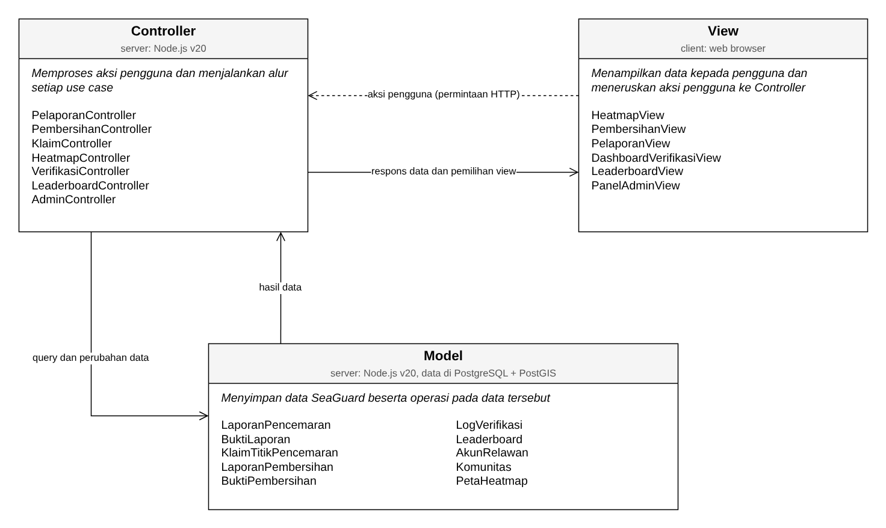

<h1>
IF2150 REKAYASA PERANGKAT LUNAK
 
TUGAS 6
 
ARSITEKTUR PERANGKAT LUNAK (APL)
</h1>
 

## *SeaGuard*

### Untuk: *Aurelia Jennifer Gunawan*

Dipersiapkan oleh:
| Informasi | Keterangan |
| --- | --- |
| Kelas | *K02* |
| Kelompok | *G01*  |

| NIM | Nama |
|---|---|
| *13525104* | *Jeremy Gerald Sutanto* |
| *13525116* | *Christian Immanuel* |
| *13525014* | *Denzel Santoso* |
| *13525011* | *Raihan* |
| *13525125* | *Peter Emmanuel Suwardy* |

---

 
 

# BAB 1: Style/Pattern Arsitektur Acuan

<i>Gambar 1. Aritektur MVC pada SeaGuard</i>

## Style/Pattern yang Dipilih

SeaGuard menggunakan pola MVC (Model-View-Controller) yang diterapkan di atas arsitektur client-server berbasis web. Peran setiap bagiannya adalah sebagai berikut.

1. **Model** mereprsentasikan data SeaGuard beserta operasi yang melekat pada data tersebut. Setiap model berasal dari kelas pada diagram kelas SKPL (C01 sampai C10), misalnya *LaporanPencemaran*, *KlaimTitikPencemaran*, dan *AkunRelawan*. *Model* bertugas menyimpan dan mengambil data dari basis data serta menjalankan operasi milik kelasnya, misalnya validasiFormatUkuran() pada *BuktiLaporan* dan validasiGeofencingRadius() pada *BuktiPembersihan*.
2. **View** adalah halaman antarmuka yang dilihat pengguna melalui web browser, seperti form pelaporan, peta heatmap, dashboard verifikasi, dan leaderboard. *View* hanya menampilkan data dan meneruskan aksi pengguna ke *Controller*. *View* tidak mengakses *Model* secara langsung.
3. **Controller** menerima permintaan dari *View*, menjalankan alur proses setiap use case (misalnya klaim titik pencemaran atau verifikasi laporan), memanggil *Model* yang dibutuhkan, lalu mengembalikan hasilnya ke *View*.

## Alasan Pemilihan

Pola MVC dipilih berdasarkan karakteristik SeaGuard berikut.

1. **Jenis pengguna.** SeaGuard memiliki dua ator, yaitu Relawan dan Verifikator/Admin, yang memakai data yang sama tetapi dengan tampilan berbeda. Dengan MVC, satu *Model* dapat dipakai oleh beberapa *View*. Contohnya, data *LaporanPencemaran* ditampilkan pada *HeatmapView* untuk Relawan dan pada *DashboardVerifikasiView* untuk Verifikator.
2. **Alur proses bisnis.** Alur SeaGuard berupa rangkaian perubahan status, yaitu laporan masuk, laporan diverifikasi, titik diklaim, hasil pembersihan dilaporkan, hasil pembersihan diverifikasi, lalu skor diberikan, sebagaimana digambarkan pada activity diagram SKPL (Gambar 1 SKPL). Aturan perubahan status ini ditempatkan pada *Controller* dan *Model* sehingga tidak tersebar di halaman antarmuka.
3. **Kebutuhan fungsional.** KF pada SKPL terbagi menjadi kebutuhan tampilan (misalnya KF01, KF06, KF09, KF15, dan KF18), kebutuhan permosesan (misalnya KF03, KF08, KF12, KF14, dan KF19), dan kebutuhan penyimpanan data (misalnya KF17 dan KF21). Pembagian ini sesuai dengan pemisahan *View*, *Controller*, dan *Model*.
4. **Kebutuhan non-fungsional.** Beberapa KNF lebih mudah dijamin apabila logika dipisahkan dari tampilan. Mekanisme *locking* klaim (KNF05), validasi *geofencing* (KNF06), dan log audit yang *immutable* (KNF07) dijalankan oleh *Controller* dan *Model* di sisi server sehingga tidak bergantung pada *View* di browser pengguna.

## Lingkungan Operasi Perangkat Lunak

Tabel 1.1. Lingkungan Operasi Perangkat Lunak

| Komponen | Spesifikasi |
| :--- | :--- |
| *Arsitektur Sistem* | *Client-Server terdistribusi secara daring (Web-based Application).* |
| *Server (Backend)* | *Node.js v20 LTS (atau ekivalen) yang dapat menangani koneksi secara real-time untuk notifikasi.* |
| *Sistem Operasi Server* | *Linux (contoh: Ubuntu 22.04 LTS) atau lingkungan berbasis container (Docker) pada layanan komputasi Cloud.* |
| *Client (Frontend)* | *Web Browser modern yang memiliki dukungan penuh terhadap HTML5, Geolocation API, dan WebGL (contoh: Google Chrome v100+, Mozilla Firefox v100+, Safari v15+, atau Microsoft Edge terbaru).* |
| *Sistem Operasi Client* | *Cross-platform (Windows, macOS, Linux, Android, iOS) selama sistem operasi tersebut mendukung web browser modern yang disyaratkan.* |
| *DBMS (Database)* | *PostgreSQL v15 (atau terbaru) dilengkapi dengan ekstensi **PostGIS** yang krusial untuk menyimpan koordinat, menghitung tingkat kepanasan heatmap, dan melakukan validasi foto.* |
| *Penyimpanan Berkas (Storage)* | *Layanan Cloud Object Storage (contoh: AWS S3, Google Cloud Storage) untuk penyimpanan dan distribusi berkas foto bukti berukuran hingga 5 MB secara terenkripsi.* |
| *Jaringan Client* | *Koneksi internet yang stabil (minimal 3G/4G/LTE untuk perangkat seluler) untuk pengiriman data formulir, unduh/unggah foto bukti, dan pemuatan layer heatmap peta.* |

Hubungan teknologi pada Tabel 1.1 dengan pola MVC adalah sebagai berikut.

1. Arsitektur *client-server* menentukan tempat berjalannya setap bagian MVC. *View* berjalan di web browser pada sisi *client*, sedangkan *Controller* dan *Model* berjalan di server Node.js.
2. Node.js tidak memiliki pola arsitektur bawaan seperti Django yang mengikuti pola MVT. Oleh karena itu, pemisahan MVC pada SeaGuard diterapkan dengan pembagian modul kode, yaitu modul *model*, *view*, dan *controller* yang terpisah.
3. Kemampuan Node.js dalam menangani koneksi *real-time* dipakai oleh komponen *Notifikasi* untuk mengirim notifikasi di dalam aplikasi ke Relawan (KF11, KNF04).
4. PostgreSQL dengan ekstensi PostGIS menjadi tempat penyimpanan seluruh data *Model*. PostGIS mendukung operasi *Model* yang berbasis koordinat, seperti `hitungHeatIntensity()` pada *PetaHeatmap* dan `validasiGeofencingRadius()` pada *BuktiPembersihan*.
5. *Cloud Object Storage* menyimpan berkaas foto bukti. *Model* hanya menyimpan URL foto (`fotoUrl`, `fotoBeforeUrl`, `fotoAfterUrl`), sedangkan proses upload berkas dilakukan oleh *Controller* melalui *StorageAdapter*.
6. Fitur browser yang dibutuhkan pada sisi *client* dipakai oleh *View*. Geolocation API dipakai untuk mengambil koordinat GPS (KF02), sedangkan WebGL dipakai untuk merender peta heatmap (KF06).

---

# BAB 2: Identifikasi Komponen / Modul / Subsistem

Komponen SeaGuard dikelompokkan berdasarkan lapisan MVC, ditambah komponen *Pendukung*, *Integrasi Eksternal*, dan *Penyimpanan Data*.

Tabel 2.1. Identifikasi Komponen/Modul/Subsistem

| Nama Komponen/Modul/Subsistem | Jenis                 | Penjelasan                                                                                                           |
| :---------------------------- | :-------------------- | :------------------------------------------------------------------------------------------------------------------- |
| *HeatmapView* | *View* | *Menampilkan peta heatmap persebaran pencemaran beserta kategori (sehat, waspada, berbahaya), filter, pencarian lokasi, dan detail titik pencemaram (UC02). Halaman ini juga menyediakan tombol klaim titik pencemaran (UC04).* |
| *PembersihanView* | *View* | *Menampilkan form laporan pembersihan berisi foto sebelum, foto sesudah, dan deskripsi kegiatan (UC05).* |
| *PelaporanView* | *View* | *Menampilkan form laporan pencemaran berisi unggah foto, indikator tingkat pencemaran, dan koordinat lokasi, beserta dialog persetujuan akses lokasi dan kamera (UC01).* |
| *DashboardVerifikasiView* | *View* | *Menampilkan antrean laporan pencemaran dan daftar pengajuan pembersihan, detail laporan, perbandingan foto before-after, serta tombol setujui/tolak bagi Verifikator (UC03, UC06).* |
| *LeaderboardView* | *View* | *Menampilkan papan peringkat beserta total poin kontribusi Relawan (UC07).* |
| *PanelAdminView* | *View* | *Menampilkan daftar akun, komunitas, dan hak akses beserta form perubahan data bagi Admin (UC08).* |
| *HeatmapController* | *Controller* | *Mengambil laporan terverifikasi, menghitung heat intensity tiap klaster titik, serta memproses filter kategori dan pencarian lokasi.* |
| *KlaimController* | *Controller* | *Memproses klaim titik pencemaran dengan mekanisme locking agar satu titik hanya dapat diklaim oleh satu Relawan.* |
| *PembersihanController* | *Controller* | *Memproses laporan pembersihan, yaitu memvalidasi geofencing foto terhadap titik klaim, mengunggaj foto melalui StorageAdapter, lalu mengubah status klaim menjadi "Menunggu Verifikasi".* |
| *PelaporanController* | *Controller* | *Memproses laporan pencemaran baru, yaitu memvalidasi format dan ukuran foto, mengekstrak metadata EXIF, mengunggah foto melalui StorageAdapter, lalu menimpan laporan.* |
| *VerifikasiController* | *Controller* | *Memproses keputusan Verifikator atas laporan pencemaran dan laporan pembersihan, mencatat log audit, menambah poin Relawan dan memperbarui leaderboard ketika pembersihan disetujui, serta meminta Notifikasi mengirim pemberitahuan ke Relawan.* |
| *LeaderboardController* | *Controller* | *Mengambil daftar peringkat dan posisi Relawan untuk ditampilkan pada LeaderboardView.* |
| *AdminController* | *Controller* | *Memproses perubahan peran, penangguhan akun, dan pembaruan data komunitas.* |
| *PetaHeatmap* | *Model* | *Merepresentasikan klaster titik pencemaran beserta heat intensity dan kategori kualitas perairannya (C10).* |
| *KlaimTitikPencemaran* | *Model* | *Merepresentasikan data klaim titik pencemaran oleh Relawan serta metode untuk mengkunci dan membatalkam klaim (C03).* |
| *BuktiLaporan* | *Model* | *Merepresentasikan foto bukti laporan pencemaran beserta metadata EXIF serta metode untuk memvalidasi format dan ukuran berkas (C02).* |
| *LaporanPencemaran* | *Model* | *Merepresentasikan data laporan pencemaran (koordinat, indikator tingkat, dan status) serta metode untuk membuat, mengambil, dan mengubah status laporan (C01).* |
| *BuktiPembersihan* | *Model* | *Merepresentasikan foto before-after beserta koordinat GPS-nya serta metode untuk memvalidasi radius geofencing (C05).* |
| *LaporanPembersihan* | *Model* | *Merepresentasikan data laporan hasil pembersihan beserta status verifikasinya (C04).* |
| *LogVerifikasi* | *Model* | *Merepresentasikan catatan audit setiap tindakan verifikasi, yaitu ID Verifikator, keputusan, dan stempel waktu (C06).* |
| *AkunRelawan* | *Model* | *Merepresentasikan data akun pengguna (profil, peran, status akun, dan total poin) serta metode untuk mengakses dan mengubahnya (C08).* |
| *Leaderboard* | *Model* | *Merepresentasikan urutan peringkat Relawan serta metode untuk menghitung ulang peringkat (C07).* |
| *Komunitas* | *Model* | *Merepresentasikan data komunitas yang dikelola oleh Admin (C09).* |
| *Notifikasi* | *Pendukung* | *Mengirim notifikasi in-app secara real-time kepada Relawan ketika status laporan atau pembersihannya diperbarui oleh Verifikator.* |
| *Autentikasi* | *Pendukung* | *Memeriksa sesi login dan peran pengguna (Relawan atau Verifikator/Admin) sebelum controller memproses permintaan, termasuk mengunci akun sementara setelah 5 kali gagal login (KNF09).* |
| *StorageAdapter* | *Integrasi Eksternal* | *Mengunggah berkas foto bukti ke layanan Cloud Object Storage dan mengembalikan URL foto untuk disimpan pada Model.* |
| *Database* | *Penyimpanan Data* | *Menyimpan seluruh data Model secara persisten pada PostgreSQL dengan ekstensi PostGIS.* |

Keterangan:
1. Seluruh kelas pada diagram kelas SKPL (C01 sampai C10) tercakup sebagai komponen *Model* dengan nama yang sama.
2. Seluruh use case dapar dijalankan oleh pasangan *View* dan *Controller* berikut: UC01 oleh *PelaporanView* dan *PelaporanController*, UC02 oleh *HeatmapView* dan *HeatmapController*, UC03 dan UC06 oleh *DashboardVerifikasiView* dan *VerifikasiController*, UC04 oleh *HeatmapView* dan *KlaimController*, UC05 oleh *PembersihanView* dan *PembersihanController*, UC07 oleh *LeaderboardView* dan *LeaderboardController*, serta UC08 oleh *PanelAdminView* dan *AdminController*.
3. Sistem di luar P/L yang disebutkan pada subbab 2.2 SKPL, yaitu Geolocation API pada browser, layanan peta pihak ketiga, dan Cloud Object Storage, tidak dimasukkan ke tabel ini. Geolocation API dan layanan peta dipakai langsung oleh *View* di browser, sedangkan Cloud Object Storage diakses dari server melalui *StorageAdapter*.

---

# BAB 3: Model Arsitektur Perangkat Lunak

*Architectural View* adalah bagaimana cara kita melihat/mendeskripsikan arsitektur sebuah sistem dari sudut pandang tertentu. Dalam perancangan arsitektur aplikasi, dibutuhkan *Architectural View* yang dapat mempermudah pemahaman dari proses aplikasi yang akan dikembangkan. Tujuan dari *Architectural View* adalah menjadi bahan komunikasi, pemisahan masalah, mempermudah analisis, dan pemandu saat eksekusi pengembangan sistem tersebut.

Buatlah model arsitektur dari aplikasi yang akan dirancang dalam bentuk *view*. Model arsitektur ini berfungsi untuk memperlihatkan bagaimana setiap komponen, modul, dan subsistem saling berinteraksi serta berkolaborasi dalam menjalankan fungsi utama sistem secara keseluruhan. Anda dapat membuat satu atau lebih *view* tergantung kebutuhan dalam bentuk gambar. Pilihlah notasi yang sesuai. Contoh *view* yang dapat digunakan antara lain ***Logical View***, ***Process View***, ***Development View***, serta ***Physical View***.

Ketentuan pengisian BAB 3:
1. Setiap view menggambarkan **keseluruhan sistem**, bukan satu use case atau satu fitur saja.
2. Buat **minimal satu view**. Setiap view dituliskan dalam subbab tersendiri (3.1, 3.2, dan seterusnya). Tidak perlu membuat keempat view, pilih yang paling membantu menjelaskan P/L Anda, lalu jelaskan alasan pemilihannya.
3. Setiap view harus **konsisten dengan BAB 2**. Seluruh komponen pada Tabel 2.1 harus muncul dengan nama yang sama, dan tidak boleh ada komponen pada view yang tidak terdaftar di Tabel 2.1.
4. Setiap view harus **mencerminkan style/pattern pada BAB 1**. Misalnya, jika memilih MVC, pembagian *Model*, *View*, dan *Controller* harus terlihat jelas pada diagram.
5. Jika membuat lebih dari satu view, setiap view harus menggambarkan sistem yang sama dari sudut pandang berbeda. View tambahan melengkapi view pertama, bukan mengulanginya.
6. Beri label pada setiap garis atau panah yang menghubungkan komponen agar hubungan antarkomponen dapat dipahami tanpa penjelasan tambahan.
7. Jika membuat *Physical View*, gambarkan lingkungan operasi pada Tabel 1.1.

## 3.1 XXX View

Tuliskan secara singkat mengenai model arsitektur perangkat lunak yang Anda pilih dan sertakan alasan mengapa model arsitektur tersebut cocok untuk aplikasi Anda.

<i>Gambar 2. Contoh Logical View pada P/L E-Commerce</i>

Gambar 2 adalah contoh *Logical View* dalam bentuk *block diagram*. Seluruh komponen pada Tabel 2.1 digambarkan dan dikelompokkan sesuai pola MVC (*View*, *Controller*, *Model*), ditambah komponen pendukung dan basis data. Sistem di luar P/L, seperti *Payment Gateway (dummy)*, digambarkan dengan garis putus-putus dan tidak perlu dimasukkan ke Tabel 2.1. Setiap garis diberi label: "Memanggil" untuk *View* yang memanggil *Controller*, "akses" untuk *Controller* yang mengakses *Model*, serta agregasi dan komposisi untuk hubungan antar-*Model*.

<b><i>Catatan</i></b>: <i>Ganti XXX dengan nama view yang dibuat, misalnya Logical View. Gambar 2 hanya contoh untuk P/L e-commerce, ganti dengan view milik kelompok Anda yang memuat seluruh komponen pada Tabel 2.1. Jenis view dan notasinya boleh berbeda dari contoh. Jika membuat view tambahan, lanjutkan pola 3.x ini (3.2, 3.3, dan seterusnya).</i>

---

# Referensi

- Sommerville, I. (2016). *Software Engineering* (10th ed.). Pearson. Chapter 6: *Architectural Design*: [https://software-engineering-book.com/slides/](https://software-engineering-book.com/slides/)
- Diagram arsitektur: [https://www.drawio.com/](https://www.drawio.com/), [https://staruml.io/](https://staruml.io/)
